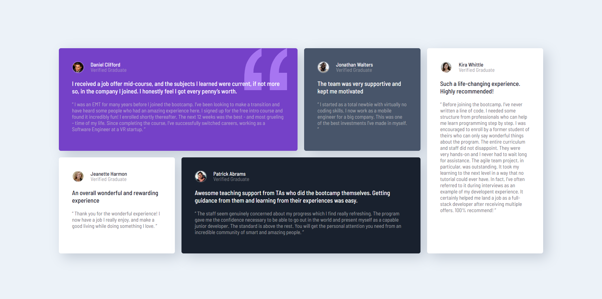

# Frontend Mentor - Testimonials grid section solution

This is a solution to the [Testimonials grid section challenge on Frontend Mentor](https://www.frontendmentor.io/challenges/testimonials-grid-section-Nnw6J7Un7). Frontend Mentor challenges help you improve your coding skills by building realistic projects. 

## Table of contents

- [Overview](#overview)
  - [The challenge](#the-challenge)
  - [Screenshot](#screenshot)
  - [Links](#links)
- [My process](#my-process)
  - [Built with](#built-with)
  - [What I learned](#what-i-learned)
  - [Continued development](#continued-development)
- [Author](#author)

## Overview

### The challenge

Users should be able to:

- View the optimal layout for the site depending on their device's screen size

### Screenshot

### Links

- Solution URL: [Add solution URL here](https://www.frontendmentor.io/profile/ricardo1003/solutions)
- Live Site URL: [Add live site URL here](https://ricardo1003.github.io/Testimonials-grid-section/)

## My process

### Built with

- Semantic HTML5 markup
- CSS custom properties
- CSS Grid
- Mobile-first workflow

### What I learned

I really learned alot more of CSS grids.

### Continued development

g r i d .

## Author

- Website - [ricardo1003](https://ricardo1003.github.io/Testimonials-grid-section/)
- Frontend Mentor - [@ricardo1003](https://www.frontendmentor.io/profile/ricardo1003)
- Github - [@ricardo1003](https://www.Github.com/ricardo1003)